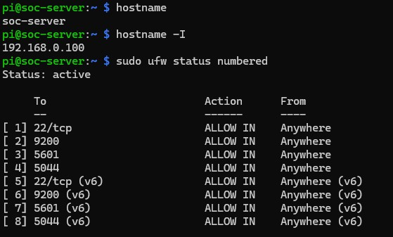
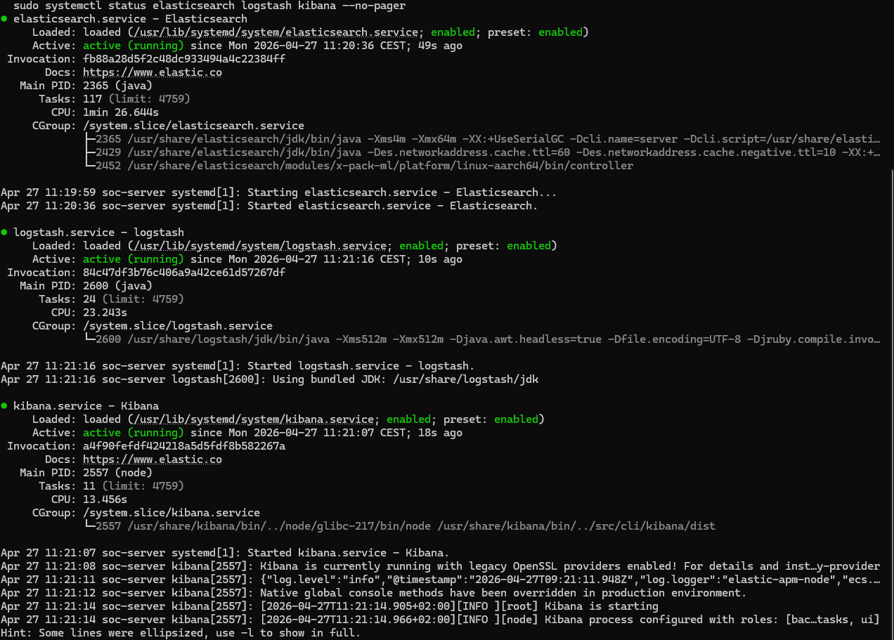
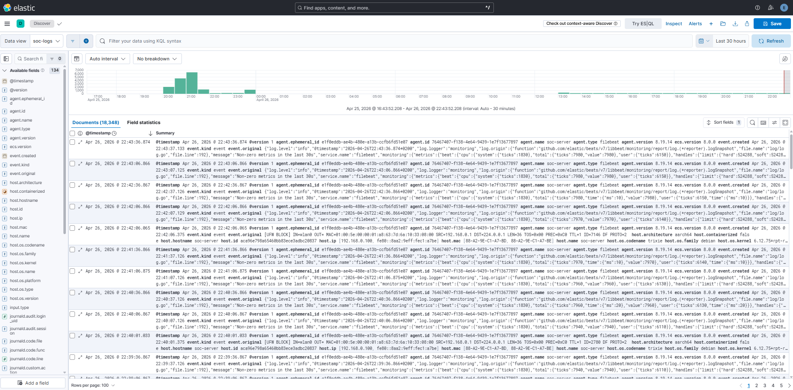
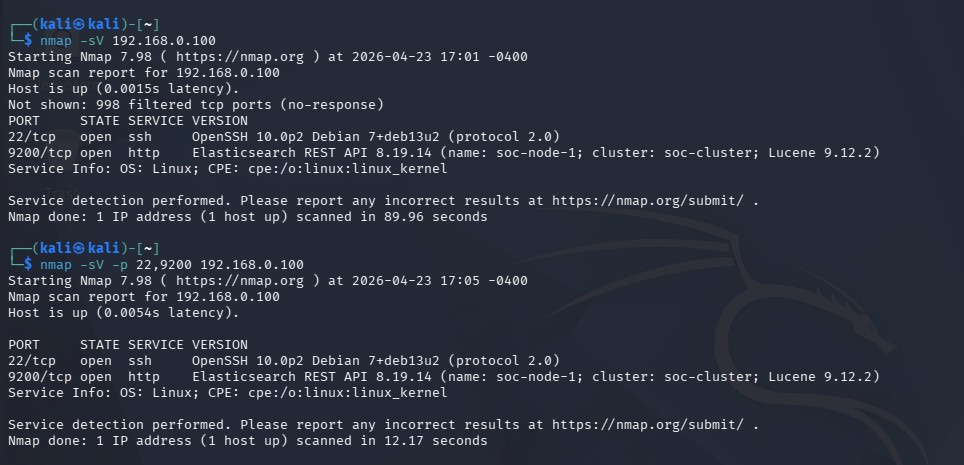
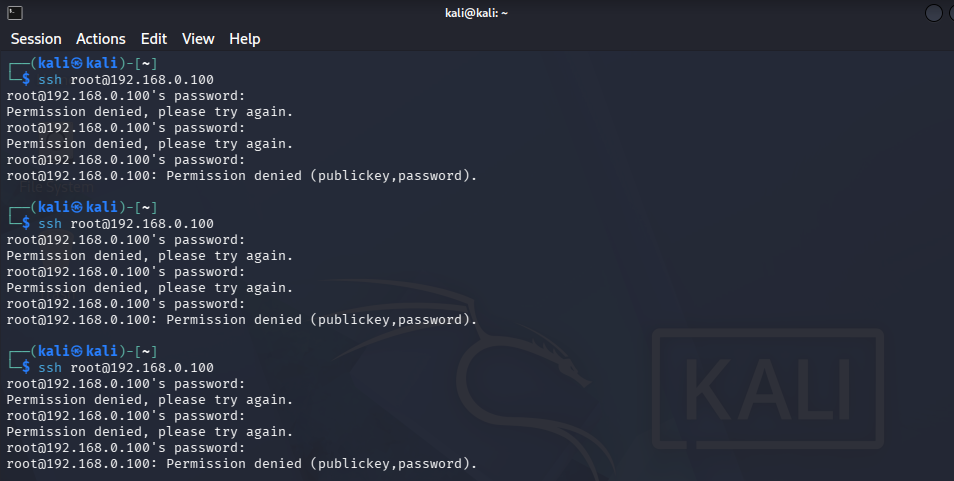
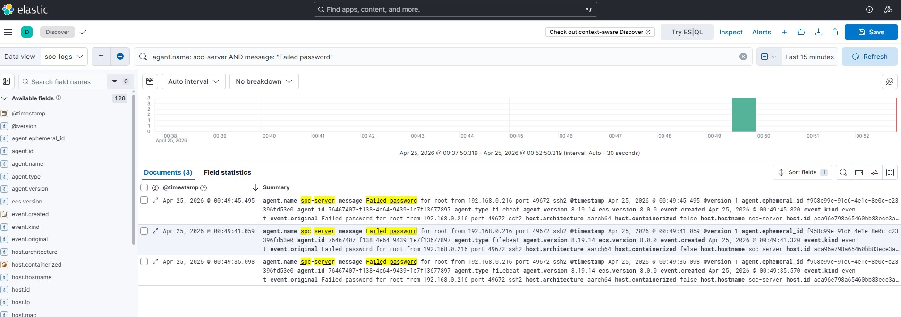
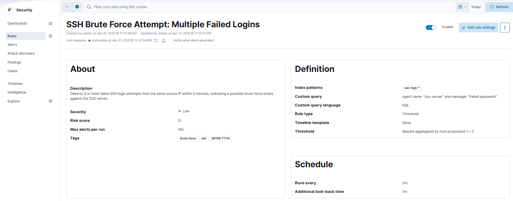
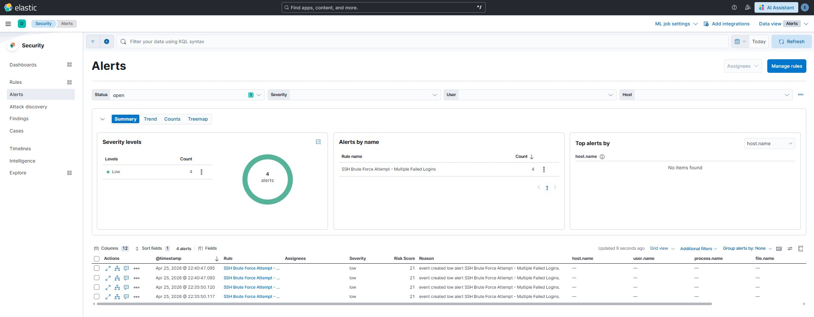
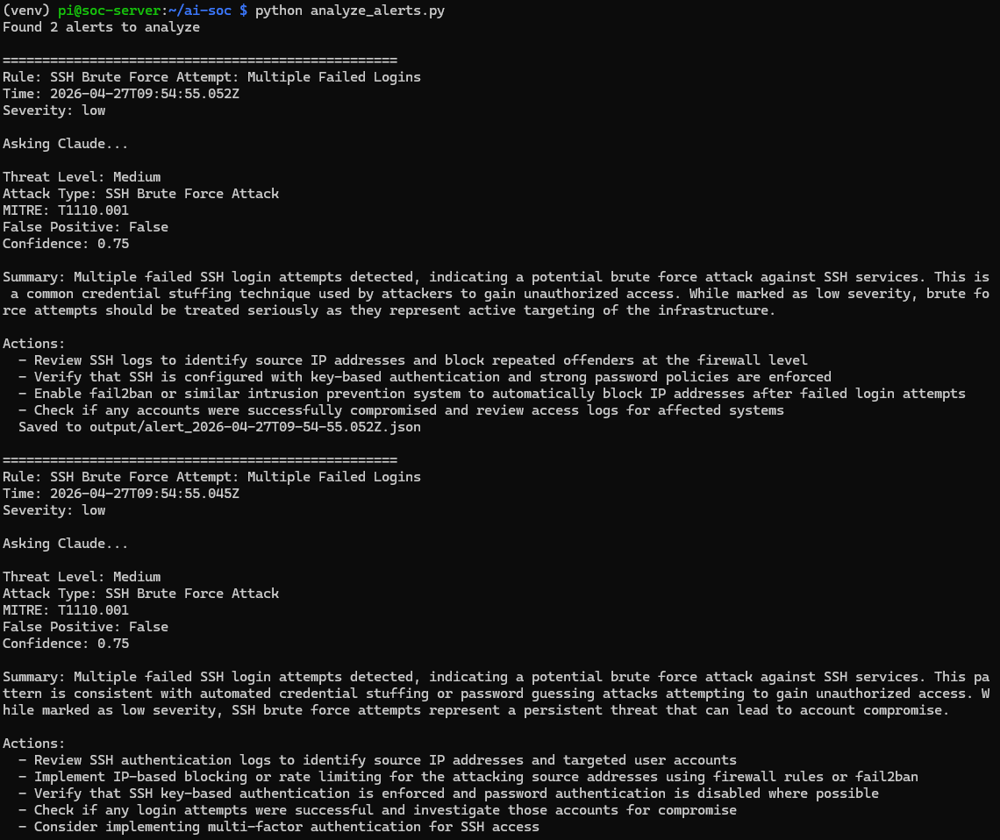
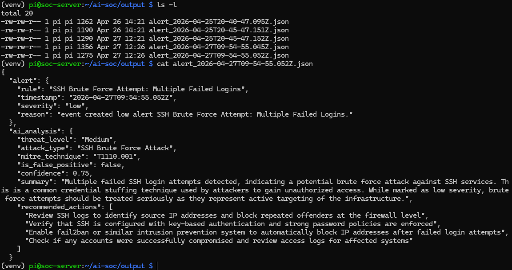

# AI Augmented SOC on a Raspberry Pi 5

> A self hosted Security Operations Center running on a Raspberry Pi 5.

It catches simulated SSH brute force attacks against the Pi, then hands each alert to **Claude** to analyze. The result comes back as structured JSON in seconds: threat level, MITRE ATT&CK mapping, false positive likelihood, and concrete remediation actions.


---

## Why I built this

I enjoy working with my Raspberry Pi 5, and I decided to see how far I could push it. The plan was simple. I decided to get the ELK Stack running on it, simulate attacks from a Kali Linux machine, and see whether an LLM could turn the resulting noise into something actually actionable. The Pi was the perfect excuse to build this on real hardware instead of cloud VMs. Limited memory, real network constraints, real consequences if I misconfigured something.
This project sits at the intersection of two things I enjoy: cybersecurity and working effectively with LLMs.

---

## What it does

Both the Kali attacker and the Pi itself run **Filebeat**, a small agent that ships every system log line into the **ELK Stack**. ELK is the open source trio at the heart of the pipeline: Elasticsearch stores and indexes the logs, Logstash parses them on the way in, and Kibana provides the search interface and detection engine on top. A custom rule in Kibana runs whenever 3 or more failed SSH logins happen within 5 minutes from the same source. A Python script then pulls those fresh alerts out of Elasticsearch through its API and hands each one to Claude with a "senior SOC analyst" prompt.

Claude returns a structured response. It gives a threat level, and reclassifies it when the static rule underrates the event. It maps the alert to a known attack technique, scores how likely the alert is a false alarm, writes a short human readable summary, and proposes concrete remediation steps. Every analysis is printed to the terminal and written as a JSON incident report.

---

## Tech Stack

| Component        | Choice                                              |
| ---------------- | --------------------------------------------------- |
| Hardware         | Raspberry Pi 5 (4 GB RAM)                           |
| Log monitoring   | ELK Stack 8.19 (Elasticsearch + Logstash + Kibana)  |
| Log shipping     | Filebeat (on Kali **and** on the Pi)                |
| Attack lab       | Kali Linux in VMware (Nmap, Hydra)                  |
| AI engine        | Anthropic Claude Sonnet 4.5 via API                 |
| Glue language    | Python 3.13                                         |
| Defense layers   | UFW firewall, Quad9 DNS, hardened SSH               |

---

## Pipeline in Action

A walkthrough from start to finish, ending with a finished incident report analyzed by AI.

### 1. The Pi, hardened

Before anything else, the Pi gets locked down. A firewall (UFW) that blocks all incoming traffic by default, a fixed IP on the lab network, a custom hostname, and SSH locked to key only authentication. The monitoring server itself is a target, and that mindset shapes every later decision.



### 2. ELK up and running

Elasticsearch, Logstash, and Kibana all running as background services on a 4 GB Pi. Memory limits are tuned conservatively (1 GB for Elasticsearch, 512 MB for Logstash) so the box doesn't crash under load.



### 3. Logs streaming into Kibana

With Filebeat shipping from both Kali and the Pi, Kibana fills up with structured events in real time. This is the raw nervous system of the SOC, and everything else is built on top of this stream.



### 4a. Reconnaissance from Kali

Before any actual attack, Kali runs an Nmap scan against the Pi to map out which ports are open and what services are listening. The scan picks up two interesting things. Port 22 is running SSH, which is the obvious target. But port 9200 is also open, exposing the Elasticsearch REST API and helpfully announcing its exact version (8.19.14), cluster name, and node name. In other words, the SIEM server is leaking its own fingerprint to anyone who scans it. That is exactly the kind of finding that turns a monitoring server into a target.



### 4b. The SSH attempt

With SSH confirmed as open, the next step is to actually trigger the detection rule. I kept this deliberately simple: a few manual SSH login attempts as root with wrong passwords from the Kali VM. This is not a sophisticated attack, and it is not meant to be. The goal is to generate the exact log pattern (multiple failed authentications from the same source in a short window) that the detection rule is built to catch.



### 4c. Failed logins land in Kibana

Every failed authentication on the Pi gets shipped to ELK by Filebeat and shows up in Kibana, filtered down to the `Failed password` pattern. This stream of events is the raw signal the detection rule watches.




### 5. Detection rule fires

The custom Kibana threshold rule sits at the heart of the SIEM. It promotes raw log events into proper alerts whenever a specific pattern shows up: 3 or more failed SSH logins from the same source IP within 5 minutes.

#### 5a. The rule itself

Built directly in Kibana's detection engine. A query filter on `agent.name: soc-server` and `message: "Failed password"`, grouped by source IP, with a threshold of 3 events. Tagged with the relevant MITRE ATT&CK technique (T1110.001) for traceability.



#### 5b. The alert fires

When the threshold is crossed, the rule generates alerts in the Security app. In this run, four alerts fired across two clusters of failed login attempts.

Notice the severity each one gets: **Low**. By the rule's own static logic, "a few failed SSH logins" doesn't look catastrophic. That label is correct on paper but missing context, the target is the SIEM itself, and the pattern is mechanical rather than human.



### 6. Claude takes the alert

The Python script pulls each alert from Elasticsearch and sends it to Claude with a senior analyst system prompt. Claude returns a structured verdict: threat level, attack type, MITRE technique, false positive assessment with a confidence score, a written summary, and a list of concrete remediation steps. The whole round trip takes a couple of seconds per alert.

In this run, all three alerts came back classified as **Medium** threat level with a confidence of 0.75 — Claude consistently disagreed with Kibana's static "Low" rating, exactly as a human analyst would after seeing the actual pattern.



### 7. Persisted as a JSON incident report

Each analysis is saved to disk as a timestamped JSON file containing both the original `alert` (rule, timestamp, severity) and the `ai_analysis` block (threat level, MITRE technique, confidence, summary, recommended actions). This is the format I would hand to downstream automation, whether that means alerting the team, opening a ticket, or kicking off an automated response.



---

## Quick Start

### Prerequisites

A Raspberry Pi 5 (or any Linux box) running 64 bit Raspberry Pi OS, with a static IP and SSH configured. ELK Stack 8.x up and running. An Anthropic API key.

### Install

```bash
git clone https://github.com/tingelholm/ai-soc-lab.git
cd ai-soc-lab

python3 -m venv venv
source venv/bin/activate
pip install -r requirements.txt

cp .env.example .env
# Edit .env with your ANTHROPIC_API_KEY, ES_HOST, ES_USER, ES_PASSWORD
```

### Run

```bash
python analyze_alerts.py
```

---

## Sample Output

```
==================================================
Rule: SSH Brute Force Attempt: Multiple Failed Logins
Severity: low

Asking Claude...

Threat Level: Medium
Attack Type: SSH Brute Force Attack
MITRE: T1110.001
False Positive: False
Confidence: 0.75

Summary: Multiple failed SSH login attempts detected,
indicating a potential brute force attack against SSH
services. Pattern is consistent with automated credential
guessing.

Actions:
  Review SSH logs to identify source IPs
  Implement rate limiting via fail2ban
  Verify SSH key based authentication is enforced

  Saved to output/alert_2026-04-25T20-45-47.152Z.json
```

---

## Key Insight

Kibana flagged this alert as **low** severity using its static thresholds. Claude correctly **elevated it to Medium** based on the attack pattern. That is the same judgment call a human analyst would make manually after eyeballing the data, and it is the whole thesis of the project in one example. Static rules are great at catching things, but bad at understanding them. An LLM in the loop bridges that gap cheaply.

> Cost per analysis: about $0.002. Time saved: around 15 minutes of analyst work per alert.

---

## Lessons Learned

**Running a full ELK Stack on 4 GB of RAM is tight but workable.** Java memory limits have to be tuned by hand (1 GB for Elasticsearch, 512 MB for Logstash) or the whole system silently starts swapping and grinding to a halt.

**The monitoring server itself is also a target.** I run Filebeat on the Pi, not just on the things being monitored. If the SOC gets compromised and is not shipping its own logs, you will never see the attack that took it down.

**Silent pipeline failures often come from encryption mismatches between components.** Filebeat will happily pretend everything is fine while quietly dropping log lines on the floor. An explicit `verify_certs=False` setting during lab work saves hours of debugging. Just don't ship that into anything resembling production.

**AI excels at the contextual reasoning that static rules can't encode.** Rules are good at "this happened N times in M minutes." LLMs are good at "this matters because…", and the second half is where most of the analyst work actually lives.

---

## Roadmap

A web dashboard (probably Streamlit) for browsing alerts visually is the next step, followed by Slack notifications so AI analyses get pushed to my phone instead of sitting in a JSON file. Beyond that: support for additional attack types like port scanning, privilege escalation, and lateral movement, Windows endpoint coverage via Winlogbeat, and prompt tuning based on the outcomes of past alerts so the system gets sharper over time.

---

## License

MIT. Use freely, attribution appreciated.
